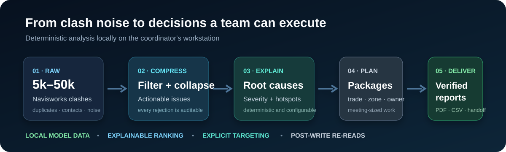

# NavisCoord

[English](README.md) · **Español**

**Convierte miles de interferencias de Autodesk Navisworks en decisiones
explicables y verificadas que el equipo de coordinación puede ejecutar.**

[](https://github.com/HorizunGroup/naviscoord-mcp/actions/workflows/ci.yml)
[](https://github.com/HorizunGroup/naviscoord-mcp/releases/latest)
[](LICENSE)
[](docs/INSTALL.md)

[Instalar en cinco minutos](docs/QUICKSTART.es.md) ·
[Último release](https://github.com/HorizunGroup/naviscoord-mcp/releases/latest) ·
[Evidencia de pruebas](docs/TESTING.md) ·
[Preguntar](https://github.com/HorizunGroup/naviscoord-mcp/discussions)



NavisCoord es un servidor MCP local de código abierto más un complemento
nativo para Navisworks. Está hecho para coordinación BIM/VDC, no para mover la
interfaz a ciegas. Los datos del modelo permanecen en la estación de trabajo.

> No está afiliado con Autodesk. El uso en vivo requiere Autodesk Navisworks
> **Manage** con licencia.

## Qué problema resuelve

Un federado puede producir entre 5.000 y 50.000 clashes, pero eso no significa
que existan 50.000 decisiones independientes. NavisCoord:

- filtra contactos esperados y declara por qué descartó cada uno;
- colapsa duplicados y cruces repetidos;
- reconcilia niveles inconsistentes desde la geometría;
- prioriza con una severidad determinista y configurable;
- detecta causas raíz sistémicas y zonas congestionadas;
- arma paquetes por disciplina, zona y responsable;
- genera PDF, CSV y datos de entrega vinculados con los elementos de autoría.

## Instalación fácil

Necesitas Windows, Python 3.10+ y Navisworks Manage 2024, 2025 o 2026. No
necesitas Visual Studio ni el SDK .NET al instalar un release.

### 1. Complemento de Navisworks

Cierra Navisworks. Descarga
[`Install-NavisCoord.ps1`](Install-NavisCoord.ps1) y ejecuta:

```powershell
powershell -ExecutionPolicy Bypass -File .\Install-NavisCoord.ps1
```

El instalador detecta las versiones instaladas, descarga los ZIP correctos,
verifica SHA-256, valida el contenido y publica únicamente los archivos de
NavisCoord con rollback. No toca perfiles personales ni otros complementos.

### 2. Plugin MCP

En Claude Code:

```text
/plugin marketplace add HorizunGroup/naviscoord-mcp
/plugin install naviscoord-mcp@horizun-navis
```

En Codex, agrega este repositorio como marketplace e instala
`naviscoord-mcp@horizun-navis`.

### 3. Primera instrucción segura

> Verifica NavisCoord sin modificar ni guardar el modelo. Después descubre y
> analiza el documento abierto, identifica causas raíz y arma el plan de
> coordinación en modo de solo lectura.

## Por qué es diferente

- **Inteligencia de coordinación, no control remoto.** El motor comprime miles
  de filas antes de pedir razonamiento al LLM.
- **Explicable.** Pesos, tolerancias, prioridades y reglas viven en un perfil;
  el puntaje se puede discutir y reproducir.
- **Escrituras honestas.** Sesión, documento y destino son explícitos; una
  mutación no se declara terminada sin releer su efecto cuando la API lo
  permite.
- **Local y acotado.** Puente loopback con token por sesión, DACL explícita,
  cola limitada y política de rutas de salida.
- **Evidencia pública.** CI, pruebas sin licencia, builds reproducibles y un
  registro separado de las pruebas que sí requieren Navisworks vivo.

## Compatibilidad

| Componente | Soporte |
|---|---|
| Sistema | Windows |
| Navisworks | Manage 2024, 2025 y 2026 |
| Python | 3.10–3.14 |
| MCP SDK | 1.9.x y 2.x |
| Add-in | .NET Framework 4.8, x64 |

## Recursos

- [Inicio rápido](docs/QUICKSTART.es.md)
- [Instalación y solución de problemas](docs/INSTALL.md)
- [Perfiles de proyecto](docs/PROFILES.md)
- [Arquitectura](docs/ARCHITECTURE.md)
- [Modelo de seguridad](docs/SECURITY-MODEL.md)
- [Pruebas y límites de evidencia](docs/TESTING.md)
- [Benchmark público](docs/BENCHMARK.md)
- [Plan de lanzamiento](docs/LAUNCH-PLAYBOOK.md)

Preguntas de uso: [Discussions](https://github.com/HorizunGroup/naviscoord-mcp/discussions).
Vulnerabilidades: [reporte privado](SECURITY.md). Contribuciones:
[CONTRIBUTING.md](CONTRIBUTING.md).

## Licencia

MIT. No se redistribuyen ensamblados de Autodesk, modelos ni datos de clientes.
